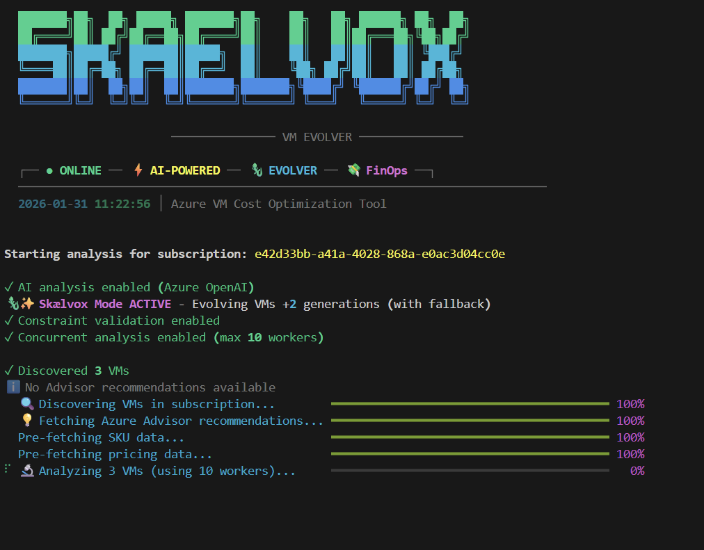

# Skælvox VM Evolver

A powerful CLI tool for Azure VM cost optimization with AI-powered rightsizing recommendations, interactive HTML reports, and adaptive generation evolution.


```
        "███████╗██╗  ██╗ █████╗ ███████╗██╗    ██╗   ██╗ ██████╗ ██╗  ██╗
        "██╔════╝██║ ██╔╝██╔══██╗██╔════╝██║    ██║   ██║██╔═══██╗╚██╗██╔╝
        "███████╗█████╔╝ ███████║█████╗  ██║    ██║   ██║██║   ██║ ╚███╔╝ 
        "╚════██║██╔═██╗ ██╔══██║██╔══╝  ██║    ╚██╗ ██╔╝██║   ██║ ██╔██╗ 
        "███████║██║  ██╗██║  ██║███████╗███████╗╚████╔╝ ╚██████╔╝██╔╝ ██╗
        "╚══════╝╚═╝  ╚═╝╚═╝  ╚═╝╚══════╝╚══════╝ ╚═══╝   ╚═════╝ ╚═╝  ╚═╝
```



## Why "Skælvox"?

**Skælvox** (pronounced "SKEL-vox") combines:

- **Skæl** (Danish) = "Scale" — like a chameleon's scales that adapt
- **Vox** (Latin) = "Voice" — speaking wisdom about upgrades

Like a chameleon, Skælvox helps your VMs evolve to newer generations while gracefully adapting when the ideal isn't available.

## Features

### VM Analysis

- **Performance Metrics**: CPU, memory, disk, and network utilization over configurable time periods
- **Azure Advisor Integration**: Incorporates Azure Advisor cost recommendations
- **Power State Detection**: Identifies running, stopped, and deallocated VMs

### Cost Optimization Scenarios

| Scenario | Description |
|----------|-------------|
| **Rightsizing** | Recommend smaller SKUs based on actual utilization |
| **Shutdown Candidates** | Identify VMs with very low utilization for shutdown |
| **Generation Upgrades** | Migrate v3/v4 to v5 series (often cheaper + faster) |
| **Regional Arbitrage** | Find cheaper regions for the same workload |

### AI-Powered Analysis

- **Dual AI Provider Support**: Choose between Azure OpenAI (GPT-4o) or Anthropic Claude
- **Intelligent Recommendations**: AI analyzes patterns and provides context-aware suggestions
- **Decision Summaries**: Clear recommendations with alternatives and trade-offs
- **Workload Detection**: Automatically infers environment types (production, dev, test) from naming patterns
- **Quick Win Identification**: Highlights low-risk, high-reward optimization opportunities
- **Executive Summaries**: AI-generated prose reports suitable for CTO/finance stakeholders

### SKU Ranking & Comparison

- **Multi-factor Scoring**: Price, performance, generation, features
- **Weighted Rankings**: Customizable ranking criteria
- **Feature Comparison**: Premium storage, accelerated networking, etc.

### Azure Spot Placement Score Integration

- **Allocation Probability**: Check VM deployment success probability before provisioning
- **Zone-Level Scores**: Get placement scores per availability zone (High/Medium/Low)
- **Regional Scores**: Assess deployment probability at regional level
- **API Integration**: Uses Azure Spot Placement Score API for real-time capacity insights
- **Risk Assessment**: Make informed decisions about SKU and region selection

Enable with `CHECK_PLACEMENT_SCORES=true` in your `.env` file or via configuration.

### Professional Terminal UI

- **Clean ASCII Art Header**: Gradient-colored SKAELVOX logo
- **Status Indicators**: Visual feature badges with color-coded icons
- **Rich Tables**: Formatted output with priority colors and status badges
- **Progress Bars**: Real-time progress during analysis phases
- **HydroToDo-Inspired Design**: Minimalist, centered layout with subtle separators

### Skælvox Mode - Adaptive Generation Evolution

**Enabled by default!** The Skælvox (pronounced "SKEL-vox") is a mythical cosmic chameleon that helps your VMs evolve to newer generations.

**How it works:**
1. **Detects** your current VM generation (v3, v4, v5, etc.)
2. **Calculates** the target generation (current + leap)
3. **Prefers** the target generation SKUs for better performance/cost
4. **Falls back** gracefully if newer generations aren't available

**Configuration:**
```bash
# Default: 2-generation leap with fallback
python main.py analyze -s <sub-id>

# Conservative: 1-generation leap
python main.py analyze -s <sub-id> --leap 1

# Aggressive: 3-generation leap
python main.py analyze -s <sub-id> --leap 3

# Strict mode: Only recommend target generation (no fallback)
python main.py analyze -s <sub-id> --no-fallback

# Disable evolution entirely
python main.py analyze -s <sub-id> --no-evolve
```

**Example Evolution:**
| Current | Leap | Target | Behavior |
|---------|------|--------|----------|
| v3 | 2 | v5 | Prefers v5 SKUs, falls back to v4 if unavailable |
| v4 | 1 | v5 | Prefers v5 SKUs, falls back to v4 if unavailable |
| v5 | 2 | v7* | Prefers newest available (v5 or v6) |

*If target doesn't exist yet, Skælvox gracefully adapts.*

## Interactive Mode

Run without arguments for an interactive menu with keyboard navigation:

```bash
python main.py
```

- **Auto Azure Login** — Authenticates with your Azure account
- **Subscription Discovery** — Lists all accessible subscriptions
- **Multi-Select** — Choose single, multiple, or ALL subscriptions (whole tenant)
- **Arrow Keys** — Navigate menus with keyboard

```
Skælvox Main Menu

What would you like to do?
> Analyze VMs - Full analysis with recommendations
  Compare Regions - Find cheaper regions for a VM
  Rank SKUs - Compare VM sizes by specs
  Check Availability - Verify SKU availability
  Show Generations - View upgrade paths
  Exit
```

## Quick Start

### Installation

```bash
# Clone the repository
git clone https://github.com/yourusername/skaelvox-vm-evolver.git
cd skaelvox-vm-evolver

# Create virtual environment
python -m venv .venv
source .venv/bin/activate  # Linux/Mac
# or: .venv\Scripts\activate  # Windows

# Install dependencies
pip install -r requirements.txt
```

### Authentication

**Option 1: Azure CLI (Development)**

```bash
az login
az account set --subscription "your-subscription-id"
```

**Option 2: Service Principal (Production)**

```bash
# Create service principal with Reader role
az ad sp create-for-rbac --name "vm-rightsizer" --role Reader \
  --scopes /subscriptions/{subscription-id}

# Add to .env file
AZURE_SUBSCRIPTION_ID=xxx
AZURE_TENANT_ID=xxx
AZURE_CLIENT_ID=xxx
AZURE_CLIENT_SECRET=xxx
```

### Basic Usage

```bash
# Full analysis with AI recommendations
python main.py analyze --subscription <sub-id>

# Analysis without AI (faster)
python main.py analyze --subscription <sub-id> --no-ai

# Analyze specific resource group
python main.py analyze -s <sub-id> -g <resource-group>

# Show detailed results
python main.py analyze -s <sub-id> --detailed --top 10

# Export to JSON
python main.py analyze -s <sub-id> --output results.json

# Export to CSV (Excel-compatible)
python main.py analyze -s <sub-id> --output results.csv

# Export to HTML (rich visual report)
python main.py analyze -s <sub-id> --output results.html

# Filter by minimum savings
python main.py analyze -s <sub-id> --min-savings 50

# Filter by priority
python main.py analyze -s <sub-id> --priority High

# Show usage examples
python main.py examples
```

## Commands

### `analyze` - Full VM Analysis

```bash
python main.py analyze [OPTIONS]

Options:
  -s, --subscription TEXT       Azure Subscription ID
  -g, --resource-group TEXT     Filter to specific resource group
  --no-metrics                  Skip performance metrics (faster)
  --no-ai                       Skip AI analysis
  -d, --detailed                Show detailed per-VM analysis
  -t, --top INTEGER             Number of results to show [default: 20]
  -o, --output TEXT             Export results (format auto-detected: .json, .csv, .html)
  -f, --format TEXT             Force output format (json, csv, html)
  --min-savings FLOAT           Filter: Show only VMs with savings >= amount
  --priority TEXT               Filter: Show only specific priority (High, Medium, Low)
  -w, --workers INTEGER         Concurrent workers for parallel processing [default: 10]
  --leap INTEGER                Skælvox generation leap distance (1-3) [default: 2]
  --no-evolve                   Disable Skælvox generation evolution
  --no-fallback                 Skælvox strict mode (no fallback to older generations)
```

**New Export Formats:**
- **JSON**: Structured data for automation and APIs
- **CSV**: Excel-compatible spreadsheet with 22 columns
- **HTML**: Beautiful responsive report with embedded CSS and charts

**Example Usage:**
```bash
# Basic analysis with HTML export
python main.py analyze -s <sub-id> -o report.html

# Filter high-priority items with savings >= $100
python main.py analyze -s <sub-id> --priority High --min-savings 100

# Fast analysis for large subscriptions
python main.py analyze -s <sub-id> --no-metrics --no-ai --workers 20

# Detailed CSV export for Excel analysis
python main.py analyze -s <sub-id> --detailed -o analysis.csv
```

**Example Output:**
```
╔══════════════════════════════════════════════════════════════════╗
║                    📈 Analysis Summary                           ║
╠══════════════════════════════════════════════════════════════════╣
║ Total VMs Discovered: 45                                         ║
║ VMs with Recommendations: 23                                     ║
║                                                                  ║
║ 💰 Cost Summary                                                  ║
║   Current Monthly Cost: $12,450.00                               ║
║   Potential Monthly Savings: $3,240.00                           ║
║   Potential Annual Savings: $38,880.00                           ║
╚══════════════════════════════════════════════════════════════════╝
```

### `check-availability` - Zone-Aware SKU Availability

```bash
python main.py check-availability --sku Standard_D16ds_v5 --region eastus2

# With Log Analytics logging
python main.py check-availability -k Standard_E8s_v5 -r westeurope \
  --log-analytics \
  --endpoint "https://your-dce.ingest.monitor.azure.com" \
  --rule-id "dcr-xxxxx"

# With placement scores enabled (requires CHECK_PLACEMENT_SCORES=true in .env)
python main.py check-availability -k Standard_D4s_v5 -r eastus

Options:
  -k, --sku TEXT         VM SKU to check (required)
  -r, --region TEXT      Azure region [default: eastus2]
  --no-zones            Skip per-zone availability check
  --no-alternatives     Skip finding alternative SKUs
  --log-analytics       Log results to Azure Monitor
  --endpoint TEXT       Log Analytics Data Collection Endpoint
  --rule-id TEXT        Log Analytics Data Collection Rule ID
  -o, --output TEXT     Output results to JSON file
```

**Placement Scores:**
When `CHECK_PLACEMENT_SCORES=true` is set, the tool queries the Azure Spot Placement Score API to show deployment success probability:
- **High**: 🟢 Very likely to succeed
- **Medium**: 🟡 May succeed, have backup plan
- **Low**: 🔴 Unlikely to succeed, consider alternatives

**Example Output:**
```
╭────────────────── 🔍 SKU Availability ──────────────────╮
│ SKU: Standard_D16ds_v5                                  │
│ Region: eastus2                                         │
│ Status: NOT AVAILABLE                                   │
│ Restriction: NotAvailableForSubscription                │
╰─────────────────────────────────────────────────────────╯

📍 Zone Availability
┌──────┬───────────┬──────────────────┐
│ Zone │ Available │ Capacity Status  │
├──────┼───────────┼──────────────────┤
│ 1    │ ✅        │ Available        │
│ 2    │ ✅        │ Available        │
│ 3    │ ❌        │ Constrained      │
└──────┴───────────┴──────────────────┘

🔄 Alternative SKUs (Available)
┌───────────────────┬───────┬────────┬────────────┬────────────┐
│ SKU Name          │ vCPUs │ Memory │ Similarity │ Zones      │
├───────────────────┼───────┼────────┼────────────┼────────────┤
│ Standard_D16s_v5  │ 16    │ 64 GB  │ 100%       │ 1, 2, 3    │
│ Standard_D16as_v5 │ 16    │ 64 GB  │ 80%        │ 1, 2       │
│ Standard_E16s_v5  │ 16    │ 128 GB │ 80%        │ 1, 2, 3    │
└───────────────────┴───────┴────────┴────────────┴────────────┘
```

### `check-availability-multi` - Multi-Region Check

```bash
python main.py check-availability-multi --sku Standard_D16ds_v5 \
  --regions "eastus,westeurope,southeastasia"
```

### `find-alternatives` - Similar SKU Search

```bash
python main.py find-alternatives --sku Standard_D16ds_v5 --region eastus2 \
  --min-similarity 70 --max 15
```

### `show-constraints` - View SKU Constraints

```bash
# Show SKU constraints for a region
python main.py show-constraints --region westeurope

# Include restricted SKUs
python main.py show-constraints -r westeurope --show-restricted

# Filter by family
python main.py show-constraints -r eastus --family D
```

### `compare-regions` - Regional Price Comparison

```bash
python main.py compare-regions --vm <vm-name> --resource-group <rg>

# Find cheaper regions for a specific VM
python main.py compare-regions -v web-server-01 -g production-rg
```

**Example Output:**
```
┌─────────────────┬─────────────┬──────────────┬─────────────────┐
│ Region          │ Monthly     │ Savings      │ Savings %       │
├─────────────────┼─────────────┼──────────────┼─────────────────┤
│ eastus          │ $145.20     │ $32.40       │ 18.2%           │
│ westeurope      │ $177.60     │ -            │ -               │
│ northeurope     │ $156.80     │ $20.80       │ 11.7%           │
└─────────────────┴─────────────┴──────────────┴─────────────────┘
```

### `rank-skus` - SKU Comparison

```bash
python main.py rank-skus --vcpus 4 --memory 16 --region westeurope

# Compare Windows VM SKUs
python main.py rank-skus -c 8 -m 32 -r eastus --os Windows
```

### `show-generations` - Generation Upgrade Paths

```bash
python main.py show-generations

# Shows recommended upgrade paths:
# Standard_D4s_v3 → Standard_D4s_v5
# Standard_E8_v4  → Standard_E8s_v5
```

### `check-quota` - Quota Usage Analysis

```bash
# Check quota usage for a region
python main.py check-quota --region westeurope

# Filter by VM family
python main.py check-quota -r eastus --family D
```

**Example Output:**
```
┌─────────────────────────────┬─────────┬───────┬───────────┬────────┬──────────┐
│ VM Family                   │ Current │ Limit │ Available │ Usage  │ Status   │
├─────────────────────────────┼─────────┼───────┼───────────┼────────┼──────────┤
│ Standard DSv5 Family vCPUs  │ 156     │ 200   │ 44        │ 78.0%  │ 🟡 Warning│
│ Standard ESv5 Family vCPUs  │ 48      │ 100   │ 52        │ 48.0%  │ 🟢 OK    │
│ Total Regional vCPUs        │ 312     │ 500   │ 188       │ 62.4%  │ 🟢 OK    │
└─────────────────────────────┴─────────┴───────┴───────────┴────────┴──────────┘
```

### `validate-sku` - SKU Constraint Validation

```bash
# Validate a SKU in a region
python main.py validate-sku --sku Standard_D4s_v5 --region westeurope

# With zone requirements
python main.py validate-sku -k Standard_E8s_v5 -r eastus --zones 1,2 --vcpus 8

# With feature requirements
python main.py validate-sku -k Standard_D8s_v5 -r northeurope \
  --features PremiumStorage,AcceleratedNetworking
```

### `check-capacity` - Available SKU Capacity

```bash
# List available SKUs in a region
python main.py check-capacity --region westeurope --vcpus 4 --memory 16

# Include restricted SKUs
python main.py check-capacity -r eastus -c 8 -m 32 --show-restricted

# Filter by features
python main.py check-capacity -r westeurope --features PremiumStorage
```

### `check-deployment` - Deployment Feasibility

```bash
# Check if deployment is possible
python main.py check-deployment --sku Standard_D4s_v5 --region westeurope

# Check for multiple VMs
python main.py check-deployment -k Standard_E16s_v5 -r eastus --count 10

# With zone requirements
python main.py check-deployment -k Standard_D8s_v5 -r westeurope -n 5 --zones 1,2
```

## Azure Monitor Log Analytics Integration

The tool can log SKU availability checks to Azure Monitor for tracking and alerting.

### Setup Data Collection Rule

1. Create a Data Collection Endpoint (DCE) in Azure Monitor
2. Create a Data Collection Rule (DCR) with custom log table
3. Grant the service principal "Monitoring Metrics Publisher" role

### Log Schema

```json
{
  "TimeGenerated": "2025-01-30T12:00:00Z",
  "sku_name": "Standard_D16ds_v5",
  "region": "eastus2",
  "subscription_id": "xxx",
  "is_available": false,
  "restriction_reason": "NotAvailableForSubscription",
  "available_zones": "1,2",
  "zone_count": 2,
  "vcpus": 16,
  "memory_gb": 64,
  "alternative_skus": "Standard_D16s_v5,Standard_D16as_v5",
  "alternative_count": 5
}
```

### KQL Query Examples

```kql
// SKU availability over time
VMSKUCapacity_CL
| where TimeGenerated > ago(7d)
| summarize AvailabilityRate = countif(is_available) * 100.0 / count() 
  by sku_name, region, bin(TimeGenerated, 1h)
| render timechart

// Constrained SKUs alert
VMSKUCapacity_CL
| where TimeGenerated > ago(1h)
| where is_available == false
| project TimeGenerated, sku_name, region, restriction_reason, alternative_skus
```

## Analysis Scenarios

### 1. Underutilized VMs (Rightsizing)

VMs with consistently low CPU/memory utilization are flagged for downsizing:

| Metric | Threshold | Action |
|--------|-----------|--------|
| Avg CPU < 20% | Low utilization | Consider smaller SKU |
| Max CPU < 50% | Overprovisioned | Rightsize recommended |
| Avg CPU < 5% | Idle | Shutdown candidate |

### 2. Generation Upgrades

Newer VM generations offer better price/performance:

```
v3 → v5: ~20-40% better performance at similar or lower cost
v4 → v5: ~10-20% improvement

Example:
Standard_D4s_v3 ($140/mo) → Standard_D4s_v5 ($125/mo)
Savings: $15/month + better performance
```

### 3. Regional Optimization

Prices vary significantly by region:

```
West Europe:    $0.192/hr (baseline)
North Europe:   $0.183/hr (-5%)
East US:        $0.166/hr (-14%)
South Central US: $0.158/hr (-18%)
```

### 4. AI-Powered Insights

When AI is enabled, the tool provides:

- **Context-aware recommendations** based on workload patterns
- **Risk assessments** for each migration
- **Prioritized action items** ranked by ROI
- **Executive summaries** for stakeholder reports

## Configuration

### Environment Variables

| Variable | Description | Default |
|----------|-------------|---------|
| `AZURE_SUBSCRIPTION_ID` | Target subscription | Required |
| `AZURE_TENANT_ID` | Azure AD tenant | Optional* |
| `AZURE_CLIENT_ID` | Service principal ID | Optional* |
| `AZURE_CLIENT_SECRET` | Service principal secret | Optional* |
| `AI_PROVIDER` | AI provider (`azure_openai` or `anthropic`) | `azure_openai` |
| `AZURE_OPENAI_ENDPOINT` | Azure OpenAI endpoint URL | Optional |
| `AZURE_OPENAI_DEPLOYMENT` | Azure OpenAI deployment name | `gpt-4o` |
| `AZURE_OPENAI_API_VERSION` | Azure OpenAI API version | `2024-02-15-preview` |
| `ANTHROPIC_API_KEY` | Claude API key (if using Anthropic) | Optional |
| `LOOKBACK_DAYS` | Metrics analysis period | 30 |
| `CPU_THRESHOLD_LOW` | Low CPU threshold (%) | 20 |
| `CPU_THRESHOLD_HIGH` | High CPU threshold (%) | 80 |

*If not provided, uses Azure CLI authentication

### SKU Ranking Weights

Customize ranking in `config.py`:

```python
SKU_RANKING_WEIGHTS = {
    "price": 0.35,        # Cost efficiency
    "performance": 0.25,  # vCPU/memory fit
    "generation": 0.20,   # Newer = better
    "features": 0.20,     # Premium storage, etc.
}
```

## 📁 Project Structure

```
skaelvox-vm-evolver/
├── main.py                  # CLI entry point (typer + rich)
├── config.py                # Configuration & mappings
├── azure_client.py          # Azure SDK interactions + SKU constraints
├── availability_checker.py  # Zone-aware SKU availability + Log Analytics
├── ai_analyzer.py           # AI integration (Azure OpenAI + Anthropic)
├── analysis_engine.py       # Core analysis logic
├── report_exporter.py       # Export to JSON, CSV, HTML with interactive dashboard
├── constraint_validator.py  # SKU constraint validation
├── demo.py                  # Demo without Azure credentials
├── requirements.txt         # Python dependencies
├── setup.py                 # Package installation
├── .env.example             # Configuration template
└── README.md                # This file
```

## 🔐 Required Azure Permissions

The tool requires these Azure RBAC permissions:

| Permission | Purpose |
|------------|---------|
| `Microsoft.Compute/virtualMachines/read` | List VMs |
| `Microsoft.Compute/virtualMachines/instanceView/read` | Power state |
| `Microsoft.Advisor/recommendations/read` | Advisor recommendations |
| `Microsoft.Insights/metrics/read` | Performance metrics |
| `Microsoft.Compute/skus/read` | Available SKUs & restrictions |
| `Microsoft.Compute/locations/usages/read` | Quota usage |

**Recommended Role**: `Reader` + `Monitoring Reader`

## 📡 Azure APIs Used

### Constraint & Capacity Validation

| API | Endpoint | Purpose |
|-----|----------|---------|
| **Resource SKUs** | `Microsoft.Compute/skus` | SKU availability, restrictions, capabilities |
| **Usage** | `Microsoft.Compute/locations/usages` | vCPU quota per family |
| **Retail Prices** | `prices.azure.com/api/retail/prices` | Current VM pricing |

### Key Data Points from Resource SKUs API

```python
# SKU restrictions (from sku.restrictions)
{
    "type": "Location" | "Zone",
    "values": ["westeurope"],
    "reasonCode": "NotAvailableForSubscription" | "QuotaExceeded"
}

# SKU capabilities (from sku.capabilities)
{
    "vCPUs": "4",
    "MemoryGB": "16",
    "PremiumIO": "True",
    "AcceleratedNetworkingEnabled": "True",
    "HyperVGenerations": "V1,V2"
}

# Zone availability (from sku.locationInfo)
{
    "location": "westeurope",
    "zones": ["1", "2", "3"]
}
```

## 📊 Export Formats & Reporting

Skælvox VM Evolver supports multiple export formats to suit different use cases:

### JSON Export
**Best for:** Automation, APIs, custom processing
```bash
python main.py analyze -s <sub-id> -o results.json
```

**Features:**
- Structured data with full analysis details
- Includes all recommendations and alternatives
- Perfect for CI/CD pipelines and automation
- Machine-readable format

### CSV Export
**Best for:** Excel analysis, spreadsheets, data analysis
```bash
python main.py analyze -s <sub-id> -o results.csv
```

**Features:**
- 22 comprehensive columns including:
  - VM details (name, resource group, location, SKU)
  - Cost analysis (current, recommended, savings)
  - Performance metrics (CPU, memory utilization)
  - Recommendations (type, priority, confidence)
  - Deployment feasibility and constraints
- Excel-compatible for pivot tables and charts
- Easy filtering and sorting in spreadsheet apps

### HTML Export
**Best for:** Executive reports, presentations, sharing with stakeholders
```bash
python main.py analyze -s <sub-id> -o report.html
```

**Features:**
- **Modern Dashboard Design** - Infracost-inspired professional styling with purple accent theme
- **Interactive Donut Chart** - Hover for tooltips, click legend to filter table by recommendation type
- **Sortable Table Columns** - Click headers to sort ascending/descending
- **Search & Filter** - Real-time search box and priority filter buttons (All/High/Medium/Low)
- **Expandable Row Details** - Click any row to reveal:
  - VM performance metrics (CPU, memory utilization)
  - AI analysis reasoning and decision summary
  - Alternative SKU options
  - Deployment feasibility and constraints
- **Score Cards** - Visual summary with VMs analyzed, recommendations count, priority breakdown
- **Executive Summary** - AI-generated prose formatted in proper paragraphs
- **Self-Contained** - Single HTML file with embedded CSS/JS, no external dependencies
- **Print-Friendly** - Clean layout for PDF export

### Format Auto-Detection
The tool automatically detects the format from the file extension:
```bash
# Automatically creates JSON
python main.py analyze -s <sub-id> -o output.json

# Automatically creates CSV
python main.py analyze -s <sub-id> -o output.csv

# Automatically creates HTML
python main.py analyze -s <sub-id> -o output.html
```

### Force Specific Format
Override auto-detection with the `--format` flag:
```bash
# Force HTML format even without extension
python main.py analyze -s <sub-id> -o report --format html
```

## 🔍 Filtering & Sorting

### Filter by Minimum Savings
Show only VMs with significant cost reduction opportunities:
```bash
# Show only VMs with monthly savings >= $50
python main.py analyze -s <sub-id> --min-savings 50

# Focus on high-value optimizations (>= $100/month)
python main.py analyze -s <sub-id> --min-savings 100
```

### Filter by Priority
Focus on recommendations by priority level:
```bash
# Show only high-priority recommendations
python main.py analyze -s <sub-id> --priority High

# Show medium-priority items
python main.py analyze -s <sub-id> --priority Medium

# Show low-priority items
python main.py analyze -s <sub-id> --priority Low
```

### Combine Filters
Stack multiple filters for precise results:
```bash
# High-priority items with significant savings
python main.py analyze -s <sub-id> --priority High --min-savings 100

# Medium-priority items in specific resource group
python main.py analyze -s <sub-id> -g production-rg --priority Medium

# High-value items with detailed output and HTML export
python main.py analyze -s <sub-id> --min-savings 75 --detailed -o report.html
```

### Limit Results
Control the number of results displayed:
```bash
# Show top 10 recommendations
python main.py analyze -s <sub-id> --top 10

# Show top 50 recommendations
python main.py analyze -s <sub-id> --top 50
```

## 🤝 Integration Ideas

### Export to Power BI
```bash
python main.py analyze -s <sub-id> -o vm-analysis.json
# Import JSON into Power BI for visualization
```

### Scheduled Analysis
```bash
# cron job example (daily at 6 AM)
0 6 * * * /path/to/venv/bin/python /path/to/main.py analyze -s xxx -o /reports/$(date +\%Y\%m\%d).json
```

### CI/CD Integration
```yaml
# Azure DevOps pipeline example
- script: |
    python main.py analyze -s $(AZURE_SUBSCRIPTION_ID) --no-ai -o results.json
  displayName: 'Run VM Rightsizing Analysis'
```

## GitHub Actions Automation

The CLI supports two modes:
- **Interactive mode**: Run `python main.py` → Login + menu selection
- **Automation mode**: Pass switches directly → Direct execution (for CI/CD)

### Example GitHub Workflow

```yaml
name: Azure VM Rightsizing Analysis

on:
  schedule:
    - cron: '0 6 * * 1'  # Weekly on Monday at 6 AM
  workflow_dispatch:  # Manual trigger

env:
  PYTHON_VERSION: '3.11'

jobs:
  analyze:
    runs-on: ubuntu-latest
    steps:
      - uses: actions/checkout@v4
      
      - name: Set up Python
        uses: actions/setup-python@v5
        with:
          python-version: ${{ env.PYTHON_VERSION }}
      
      - name: Install dependencies
        run: pip install -r requirements.txt
      
      - name: Azure Login
        uses: azure/login@v2
        with:
          creds: ${{ secrets.AZURE_CREDENTIALS }}
      
      # 🦎 Single Subscription Analysis
      - name: Analyze VMs
        run: |
          python main.py analyze \
            -s ${{ secrets.AZURE_SUBSCRIPTION_ID }} \
            --no-ai \
            --output results.json
      
      # 📊 Upload results as artifact
      - name: Upload Analysis Report
        uses: actions/upload-artifact@v4
        with:
          name: vm-rightsizing-report
          path: results.json

  # Multi-subscription analysis (whole tenant)
  analyze-tenant:
    runs-on: ubuntu-latest
    strategy:
      matrix:
        subscription:
          - name: Production
            id: ${{ secrets.PROD_SUBSCRIPTION_ID }}
          - name: Development  
            id: ${{ secrets.DEV_SUBSCRIPTION_ID }}
          - name: Staging
            id: ${{ secrets.STAGING_SUBSCRIPTION_ID }}
    steps:
      - uses: actions/checkout@v4
      
      - name: Set up Python
        uses: actions/setup-python@v5
        with:
          python-version: '3.11'
      
      - name: Install dependencies
        run: pip install -r requirements.txt
      
      - name: Azure Login
        uses: azure/login@v2
        with:
          creds: ${{ secrets.AZURE_CREDENTIALS }}
      
      - name: Analyze ${{ matrix.subscription.name }}
        run: |
          python main.py analyze \
            -s ${{ matrix.subscription.id }} \
            --no-ai \
            --leap 2 \
            --output results-${{ matrix.subscription.name }}.json
      
      - name: Upload Report
        uses: actions/upload-artifact@v4
        with:
          name: report-${{ matrix.subscription.name }}
          path: results-${{ matrix.subscription.name }}.json
```

### CLI Switches for Automation

| Switch | Description | Example |
|--------|-------------|---------|
| `-s, --subscription` | Azure Subscription ID | `-s abc123-...` |
| `-g, --resource-group` | Filter by resource group | `-g production-rg` |
| `--no-ai` | Skip AI analysis (faster) | `--no-ai` |
| `--output, -o` | Export results to JSON | `-o results.json` |
| `--top` | Limit results | `--top 20` |
| `--detailed` | Include detailed metrics | `--detailed` |
| `--leap` | Skælvox generation leap (1-3) | `--leap 2` |
| `--no-evolve` | Disable generation evolution | `--no-evolve` |
| `--no-fallback` | Strict generation targeting | `--no-fallback` |

### Environment Variables for Secrets

```yaml
# GitHub Actions secrets
env:
  AZURE_SUBSCRIPTION_ID: ${{ secrets.AZURE_SUBSCRIPTION_ID }}
  AZURE_TENANT_ID: ${{ secrets.AZURE_TENANT_ID }}
  AZURE_CLIENT_ID: ${{ secrets.AZURE_CLIENT_ID }}
  AZURE_CLIENT_SECRET: ${{ secrets.AZURE_CLIENT_SECRET }}
  ANTHROPIC_API_KEY: ${{ secrets.ANTHROPIC_API_KEY }}  # Optional, for AI
```

### Scheduled Multi-Region Check

```yaml
name: SKU Availability Monitor

on:
  schedule:
    - cron: '*/30 * * * *'  # Every 30 minutes

jobs:
  check-availability:
    runs-on: ubuntu-latest
    steps:
      - uses: actions/checkout@v4
      - uses: actions/setup-python@v5
        with:
          python-version: '3.11'
      - run: pip install -r requirements.txt
      
      - name: Azure Login
        uses: azure/login@v2
        with:
          creds: ${{ secrets.AZURE_CREDENTIALS }}
      
      - name: Check Critical SKUs
        run: |
          python main.py check-availability-multi \
            --sku Standard_D16ds_v5 \
            --regions "eastus,westeurope,southeastasia" \
            -s ${{ secrets.AZURE_SUBSCRIPTION_ID }}
```

## Roadmap

- [x] Interactive CLI with keyboard navigation
- [x] Multi-subscription support (whole tenant scanning)
- [x] Regional price comparison (50+ Azure regions)
- [x] Skælvox adaptive generation evolution
- [x] HTML report generation with interactive dashboard
- [x] Azure OpenAI integration (GPT-4o support)
- [x] Professional terminal UI (HydroToDo-inspired design)
- [x] Interactive donut charts with tooltips
- [x] Sortable/filterable recommendation tables
- [x] Expandable row details with AI insights
- [ ] Reserved Instance recommendations
- [ ] Spot VM opportunity analysis
- [ ] Azure Hybrid Benefit optimization
- [ ] Slack/Teams notifications
- [ ] Terraform output for automation
- [ ] Dark mode HTML reports

## License

MIT License - see LICENSE file for details.

---

**Skælvox VM Evolver** — Azure VM cost optimization with AI-powered insights, interactive dashboards, and adaptive generation evolution.

🦎 *Like a chameleon, Skælvox helps your VMs evolve to newer generations while gracefully adapting when the ideal isn't available.*
